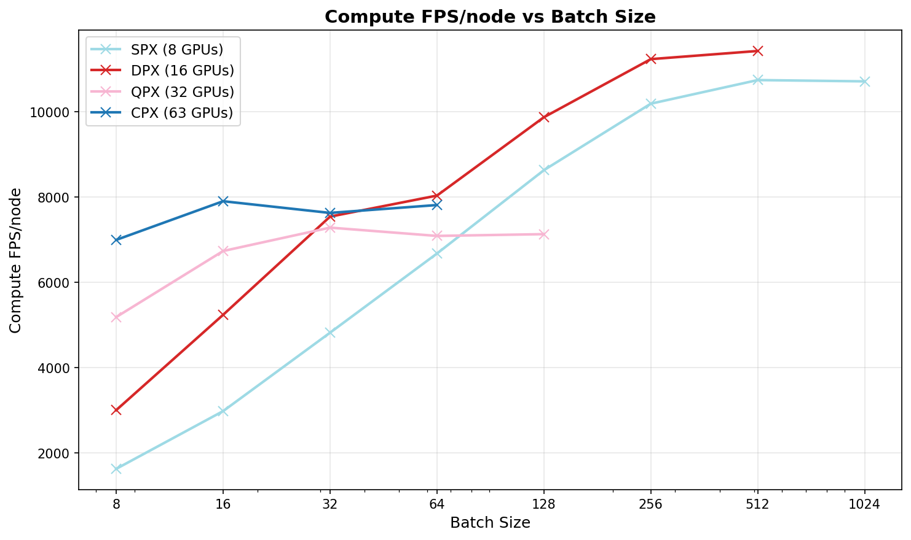
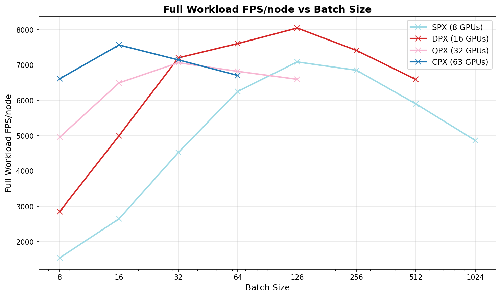

# Training AutoSpeed on AMD GPUs

The code in this directory accompanies the ROCm Blogs article on training and running hyperparameter optimization on AutoSpeed using AMD GPUs.
This file provides a detailed guide to reproducing the comparisons and experiments in the blog post.

There are two main topics covered here:
1. Training AutoSpeed on AMD GPUs, making efficient use of GPU resources for heavy parallelization by using AMD's *GPU partitioning*;
2. Applying the resulting efficient parallelization to hyperparameter optimization (HPO).

(**TODO: add link to the article**)

## Data and Code

First, download training and validation data from
[OpenLane](https://github.com/OpenDriveLab/OpenLane/blob/main/data/README.md).
Download the following files from any of the sources:
 * `cipo.zip`
 * `scene.zip`
 * `images_training_0.tar`
 * `images_validation_0.tar`

Or, if you are using the full dataset (as in the final training below), download all splits.
To download from OpenDataLab, first fill in the OpenLane form, then:
 1. create an account on OpenDataLab and create an SDK key;
 2. follow the instructions at https://opendatalab.com/OpenDriveLab/OpenLane/cli/main to use the CLI tool to download the full dataset.

Set the storage locations.
 * Downloaded archives should be stored in `DATA_DOWNLOAD_DIR`. 
 * `DATA_DIR` is where we will extract them to. Place on a fast storage device, as this will be used during training.
 * `CODE_DIR` is a location where we will clone the Git repository containing this file.
```sh
DATA_DOWNLOAD_DIR=</path/to/downloaded/data>
DATA_DIR=</path/to/dir/for/extracted/preprocessed/data>
# Example: change if you want
CODE_DIR=~/auto_speed
TUTORIAL_DIR=$CODE_DIR/Models/tutorials/auto_speed_hpo_amd
```

If you don't already have this repo in `CODE_DIR`, clone it there:
```bash
git clone https://github.com/autowarefoundation/auto_speed.git $CODE_DIR
```

Build the Docker container that we will use to run training. The build context must be the **repository root** (the trailing `.`), so that `requirements.txt` and the `Models/` directory are included in the image:
```bash
cd $CODE_DIR
docker build -t autospeed-$USER -f Models/tutorials/auto_speed_hpo_amd/Dockerfile .
```

Inside the container, the repository is installed at `/app/auto_speed` (see `WORKDIR` in the Dockerfile). All `docker run` volume mounts below use that path.

## Data Preparation and Basic Training

We run both training data preparation and training inside a Docker container. You can select here which GPU you wish to use for training by setting `AMD_VISIBLE_DEVICES` to a GPU ID (or `all`).

We will use the same Docker command for all the experiments below. It mounts the `DATA_DOWNLOAD_DIR` and the `DATA_DIR`, so that we can re-use data pre-processing whose outputs get stored in the `DATA_DIR`.

Output will go to `$CODE_DIR/output`.

```sh
# Start a Docker container with an interactive shell
export AMD_VISIBLE_DEVICES=1

docker run --runtime=amd \
    -e AMD_VISIBLE_DEVICES \
    -it \
    --shm-size=128GB \
    -v $DATA_DOWNLOAD_DIR:/app/auto_speed/raw_data \
    -v $DATA_DIR:/app/auto_speed/data \
    -v $CODE_DIR/output:/app/auto_speed/Models/training/runs \
    autospeed-$USER:latest bash

# The following commands should be executed within the running Docker container shell
# Take the raw data from $DATA_DOWNLOAD_DIR and unpack to $DATA_DIR
/app/auto_speed/Models/tutorials/auto_speed_hpo_amd/unpack_data.sh \
    /app/auto_speed/raw_data \
    /app/auto_speed/data 1

# Train the model: this uses some of our optimizations
# See below for how to run different versions with different optimizations
python3 /app/auto_speed/Models/training/auto_speed_trainer.py \
    --dataset /app/auto_speed/data \
    --config /app/auto_speed/Models/config/auto_speed.yaml \
    --batch-size 32
```

## AutoSpeed Version

The experiments below were run prior to version 2.0 of AutoSpeed. All relevant code has been updated, so that the commands given here work, but you may observe differences in the exact absolute timings, even if using identical hardware, due to changes to the AutoSpeed model itself. The pattern of results, however, is expected to remain the same.


## Comparison of Performance Optimizations

We run several different versions of the training procedure and collect throughput results.
This reproduces the results reported in the blogpost.

```sh
export AMD_VISIBLE_DEVICES=1

docker run --runtime=amd \
    -e AMD_VISIBLE_DEVICES \
    -it \
    --shm-size=128GB \
    -v $DATA_DOWNLOAD_DIR:/app/auto_speed/raw_data \
    -v $DATA_DIR:/app/auto_speed/data \
    -v $CODE_DIR/output:/app/auto_speed/Models/training/runs \
    autospeed-$USER:latest bash
```

Run the optimization comparison experiments by running the `optimization_comparison.sh` script within the container. This script runs all optimization variants and collects the throughput results.

Alternatively, you can run different combinations one by one by setting the following parameters to `auto_speed_trainer.py`:
* `--disable_vectorized_loss`: Disable vectorization of the loss function (enabled by default), using the original implementation. This is equivalent to training prior to any optimizations.
* No parameters: Vectorize the loss, but do not apply other optimizations.
* `--use_preprocessed`: Use preprocessed images. Not enabled by default. To reproduce the experiment using *just* preprocessing, also disable the vectorized loss.
* `--do_compile`: Use `torch.compile` to speed up loss computation. Not enabled by default, as it adds startup cost, but provides a speedup overall if running for many epochs. To reproduce the experiment using *just* compilation, also disable the vectorized loss.
* `--do_compile --use_preprocessed`: All optimizations, the fastest way to train.


### Results

Each optimization brings a substantial improvement in compute throughput. Vectorization and compilation only bring a modest improvement in overall throughput, since iteration time is dominated by data loading. Pre-processing brings a large improvement to both compute throughput and overall throughput.

We get the highest throughput by combining all optimizations.

| **Run**        | **Compute throughput (FPS)** | **Full throughput (FPS)** |
|----------------|------------------------------|---------------------------|
| Original       | 241.23                       | 117.36                    |
| Vectorized loss | 505.18                      | 131.81                    |
| Pre-processing | 685.18                       | 656.04                    |
| torch.compile  | 485.09                       | 132.12                    |
| All            | 746.46                       | 714.69                    |

## Using GPU partitioning

To make best use of an 8-GPU node when we need to run a large number of training runs for HPO, we use **GPU partitioning**. This splits the resources of each GPU to expose multiple logical GPUs.

We must first enable GPU partitioning for the whole node. We choose one of the following modes:
- **SPX (Single Partition X-celerator):** Unpartitioned, 8 GPUs, each with 304 CUs, 192GB HBM.
- **DPX (Dual Partition X-celerator):** 2-way split, 16 GPUs, each with 152 CUs, 96GB HBM.
- **QPX (Quadruple Partition X-celerator):** 4-way, 32 GPUs, each with 76 CUs, 48GB HBM.
- **CPX (Core Partitioned X-celerator):** 8-way, 63 GPUs (on some systems 64 GPUs), each with 38 CUs, 24GB HBM.

### Running the Experiment

We compare the throughput of the whole node in a scenario where training runs are being run in parallel, one for each logical GPU, simulating the situation when running many training runs for HPO. Higher levels of partitioning therefore train more models overall, but we are not interested in the overall runtime of the job, but the throughput.

The comparison can be run by first setting the node's partitioning mode to the desired mode (SPX, DPX, QPX or CPX) and then running `run_partition_exp.sh` within Docker. The same script can be used for each mode, as it detects how many logical GPUs are available and uses them all.

```bash
# Set partitioning mode
sudo amd-smi set --gpu all --compute-partition <SPX/DPX/QPX/CPX>
docker run --rm --runtime=amd \
    -e AMD_VISIBLE_DEVICES=all \
    --shm-size=256GB \
    -v $DATA_DOWNLOAD_DIR:/app/auto_speed/raw_data \
    -v $DATA_DIR:/app/auto_speed/data \
    -v $CODE_DIR/output/output_partition_exp:/app/auto_speed/Models/training/runs \
    autospeed-$USER:latest bash -c "/app/auto_speed/Models/tutorials/auto_speed_hpo_amd/run_partition_exp.sh"
```

### Results

Collect the results from the individual run outputs for each partitioning mode and batch size and aggregate them. This also outputs the table of results.

```bash
python $TUTORIAL_DIR/compare_throughput_experiments.py --root $CODE_DIR/output/output_partition_exp
```

We got the following results:

**Compute throughput**

| **Mode** | BS: 8 | BS: 16 | BS: 32 | BS: 64 | BS: 128 | BS: 256 | BS: 512 | BS: 1024 |
|----------|----------|----------|----------|----------|----------|----------|----------|----------|
| SPX (8) | 1628.11 | 2981.63 | 4820.22 | 6676.34 | 8630.43 | 10189.99 | 10743.90 | 10713.37 |
| DPX (16) | 3004.56 | 5239.93 | 7541.88 | 8034.96 | 9871.93 | 11234.65 | 11426.22 | OOM |
| QPX (32) | 5213.79 | 7966.11 | 8136.84 | 9928.80 | 12259.26 | 12919.76 | OOM |  |
| CPX (63) | 7332.09 | 8778.45 | 10135.97 | 12249.20 | 13982.04 | OOM |  |  |



**Full throughput**

| **Mode** | BS: 8 | BS: 16 | BS: 32 | BS: 64 | BS: 128 | BS: 256 | BS: 512 | BS: 1024 |
|----------|----------|----------|----------|----------|----------|----------|----------|----------|
| SPX (8) | 1543.11 | 2648.16 | 4527.69 | 6255.42 | 7089.41 | 6852.31 | 5901.14 | 4866.34 |
| DPX (16) | 2854.57 | 5001.31 | 7206.17 | 7608.72 | 8048.65 | 7413.93 | 6593.21 | OOM |
| QPX (32) | 4980.22 | 7621.19 | 7569.52 | 7036.34 | 7191.75 | 6861.48 | OOM |  |
| CPX (63) | 6943.64 | 8309.19 | 7383.76 | 6823.60 | 6701.83 | OOM |  |  |



## Hyperparameter Optimization (HPO) using Optuna

Optuna is an automatic hyperparameter optimization framework for machine learning models. It explores the hyperparameter space by sampling values for the hyperparameters from pre-defined ranges for each trial, for a set number of trials in a study.

### Hyperparameter Space

In standard AutoSpeed training, `auto_speed.yaml` defines a single set of hyperparameters. These can be adjusted manually to change (1) learning parameters (learning rate, etc); (2) loss term coefficients; and (3) augmentation parameters (data augmentations to use).

We provide `tune_autospeed_optuna.py` to run an HPO study with AutoSpeed's hyperparameters. Ranges (or fixed values) for each hyperparameter can be specified in a YAML file, defining Optuna's search space.

We include two examples of HPO studies that might be used to optimize these hyperparameters.

1. `experiment1.yaml`: Optimize all learning parameters and loss term coefficients. This explores a large search space of seven hyperparameters and is the experiment reported in the ROCm blogpost.
2. `experiment2.yaml`: Optimize only loss term coefficients. This tunes only three hyperparameters, so is able to explore the space more rigorously.

In these experiments, we use a different dataset split to that used above. While performing HPO, it is important not to use the OpenLane dataset's train/test split to optimize hyperparameters, or else we will overfit the test set. The data preparation scripts therefore also make a new split into `train_hpo` and `val_hpo`, which are a split of the *training data only* from OpenLane. This will be used during HPO and we only evaluate the final best hyperparameters on the test set. We therefore do not touch the OpenLane test data ("val") during HPO.

### GPU Partitioning

Since we got the best training parallelisation performance for smaller batch sizes from **CPX** partitioning, we run the HPO studies in that mode.

However, we also run experiment 1 in **SPX** mode, in order to confirm that the superior throughput carries over from the simple multi-process setup used for the experiment above to a real HPO study.

### Running Without Partitioning

Set the node's partitioning mode to SPX (i.e. unpartitioned default mode) to try HPO without partitioning. This runs HPO over seven hyperparameters: optimizer parameters and loss component weights (see `experiment1.yaml` above).

```bash
docker run --rm --runtime=amd \
    -e AMD_VISIBLE_DEVICES=all \
    --shm-size=256GB \
    -v $DATA_DOWNLOAD_DIR:/app/auto_speed/raw_data \
    -v $DATA_DIR:/app/auto_speed/data \
    -v $CODE_DIR/output/hpo_partitioning:/app/auto_speed/Models/training/runs \
    autospeed-$USER:latest bash -c "/app/auto_speed/Models/tutorials/auto_speed_hpo_amd/run_hpo.sh spx experiment1 --trials 100 --epochs 5"
```

Output:
```text
+ python3 /app/auto_speed/Models/hyperparam_optim/tune_autospeed_optuna.py --dataset /app/auto_speed/data --hpo_ranges /app/auto_speed/Models/tutorials/auto_speed_hpo_amd/hpo_config/experiment1.yaml --runs_dir /app/auto_speed/Models/training/runs/experiment1/optuna_SPX_bs32 --best_params_output /app/auto_speed/Models/training/runs/experiment1/optuna_SPX_bs32/best_params.yaml --do_compile --default_config /app/auto_speed/Models/config/auto_speed.yaml --trials 100 --epochs 5
Writing logs and output to /app/auto_speed/Models/training/runs/experiment1/optuna_SPX_bs32/study-2026-05-12-0000/optuna_trials.log
2026-05-12 17:53 Number of available GPUs: 8
[I 2026-05-12 17:53:52,507] A new study created in RDB with name: autospeed_optuna
2026-05-12 17:53 Created Optuna study using sampler TPESampler
2026-05-12 17:53 Starting Optuna optimization with 8 workers
...
2026-05-12 18:59 All trials completed in 3942.68 seconds
2026-05-12 18:59 Best config: {'min_lr': 1.9965756016334015e-05, 'max_lr': 0.0013761490118146139, 'momentum': 0.9084947097692975, 'weight_decay': 0.000330080930507702, 'box': 9.438693861981758, 'cls': 2.1965982943244144, 'dfl': 2.468625220819969}
2026-05-12 18:59 Best metrics: {'map50': 0.521202462680222, 'precision': 0.593331965863715, 'recall': 0.5102997205621025}
```

### Running With Partitioning

Make sure you have set the node's partitioning mode to CPX (see above).

```bash
docker run --rm --runtime=amd \
    -e AMD_VISIBLE_DEVICES=all \
    --shm-size=256GB \
    -v $DATA_DOWNLOAD_DIR:/app/auto_speed/raw_data \
    -v $DATA_DIR:/app/auto_speed/data \
    -v $CODE_DIR/output/hpo_partitioning:/app/auto_speed/Models/training/runs \
    autospeed-$USER:latest bash -c "/app/auto_speed/Models/tutorials/auto_speed_hpo_amd/run_hpo.sh cpx experiment1 --trials 100 --epochs 5"
```

Output:
```text
+ python3 /app/auto_speed/Models/hyperparam_optim/tune_autospeed_optuna.py --dataset /app/auto_speed/data --hpo_ranges /app/auto_speed/Models/tutorials/auto_speed_hpo_amd/hpo_config/experiment1.yaml --runs_dir /app/auto_speed/Models/training/runs/experiment1/optuna_CPX_bs32 --best_params_output /app/auto_speed/Models/training/runs/experiment1/optuna_CPX_bs32/best_params.yaml --do_compile --default_config /app/auto_speed/Models/config/auto_speed.yaml --fp32 --trials 100 --epochs 5
Writing logs and output to /app/auto_speed/Models/training/runs/experiment1/optuna_CPX_bs32/study-2026-05-13-0000/optuna_trials.log
2026-05-13 10:33 Number of available GPUs: 63
[I 2026-05-13 10:33:04,335] A new study created in RDB with name: autospeed_optuna
2026-05-13 10:33 Created Optuna study using sampler TPESampler
2026-05-13 10:33 Starting Optuna optimization with 63 workers
...

```

### A Real HPO Study

Up to now, we have run only five epochs of each model training and only 100 HPO trials (separate samples from the hyperparameter space).
To find better hyperparameters, we need to run more trials and train for longer.

We will do this with the same HPO study setup we used in the comparison of the previous section. We train each model for 15 epochs – only half the default full model training, but enough to have a good idea from the validation metrics of which model is most promising.

This time we specify a path to output the best parameters to, so we can use it for training a model afterwards. This will produce a YAML file that we can load in the next step to train a model for longer with these parameters.

```bash
docker run --runtime=amd \
    --shm-size=128GB \
    -e AMD_VISIBLE_DEVICES \
    -v $DATA_DOWNLOAD_DIR:/app/auto_speed/raw_data \
    -v $DATA_DIR:/app/auto_speed/data \
    -v $CODE_DIR/output/real_hpo:/app/auto_speed/Models/training/runs \
    autospeed-$USER:latest bash -c "
        /app/auto_speed/Models/tutorials/auto_speed_hpo_amd/run_hpo.sh cpx experiment1 \
        --trials 200 \
        --epochs 15 \
        --best_params_output /app/auto_speed/Models/training/runs/best_params_exp1.yaml
    "
```

Output:
```text
python3 /app/auto_speed/Models/hyperparam_optim/tune_autospeed_optuna.py --dataset /app/auto_speed/data --hpo_ranges /app/auto_speed/Models/tutorials/auto_speed_hpo_amd/hpo_config/experiment1.yaml --runs_dir /app/auto_speed/Models/training/runs/experiment1/optuna_CPX_bs32 --default_config /app/auto_speed/Models/config/auto_speed.yaml --fp32 --trials 200 --epochs 15 --best_params_output /app/auto_speed/Models/training/runs/best_params_exp1.yaml
Writing logs and output to /app/auto_speed/Models/training/runs/experiment1/optuna_CPX_bs32/study-2026-05-04-0007/optuna_trials.log
2026-05-04 13:09 Number of available GPUs: 63
[I 2026-05-04 13:09:58,089] A new study created in RDB with name: autospeed_optuna
2026-05-04 13:09 Created Optuna study using sampler TPESampler
2026-05-04 13:09 Starting Optuna optimization with 63 workers
...
2026-05-04 16:26 All trials completed in 11784.10 seconds
2026-05-04 16:26 Best config: {'min_lr': 1.2258696739141489e-06, 'max_lr': 0.004530873922785644, 'momentum': 0.920980067191989, 'weight_decay': 0.004901382992443423, 'box': 7.165629256439859, 'cls': 1.5720644162703492, 'dfl': 2.520700260693012}
2026-05-04 16:26 Best metrics: {'map50': 0.6810260577349649, 'precision': 0.75545777563137, 'recall': 0.6396335212578396}
```

We can now train a model for the full 30 epochs using these best parameters:

```bash
python3 /app/auto_speed/Models/training/auto_speed_trainer.py \
    --dataset /app/auto_speed/data \
    --config /app/auto_speed/Models/training/runs/best_params_exp1.yaml \
    --epochs 30 \
    --do_compile \
    --use_preprocessed \
    --runs_dir /app/auto_speed/Models/training/runs/train-best-params
```

For comparison, we can train a model for 30 epochs using the default parameters:

```bash
python3 /app/auto_speed/Models/training/auto_speed_trainer.py \
    --dataset /app/auto_speed/data \
    --config /app/auto_speed/Models/config/auto_speed.yaml \
    --epochs 30 \
    --do_compile \
    --use_preprocessed \
    --runs_dir /app/auto_speed/Models/training/runs/train-default-params
```

We can collect the evaluation results from the logging output:
```bash
# Collect results from the model with default params
tail -n 1 $CODE_DIR/output/real_hpo/train-default-params/*/validation.log
# Collect results from the model with optimized params
tail -n 1 $CODE_DIR/output/real_hpo/train-best-params/*/validation.log
# These correspond to:
#   precision    recall     mAP50       mAP
```

|                  | P %  | R %  | MAP50 % | MAP % | 
|------------------|------|------|---------|-------|
| Default params   | 80.3 | 67.3 | 73.2    | 56.4  |
| Optimized params | 84.1 | 69.0 | 75.4    | 57.7  |
